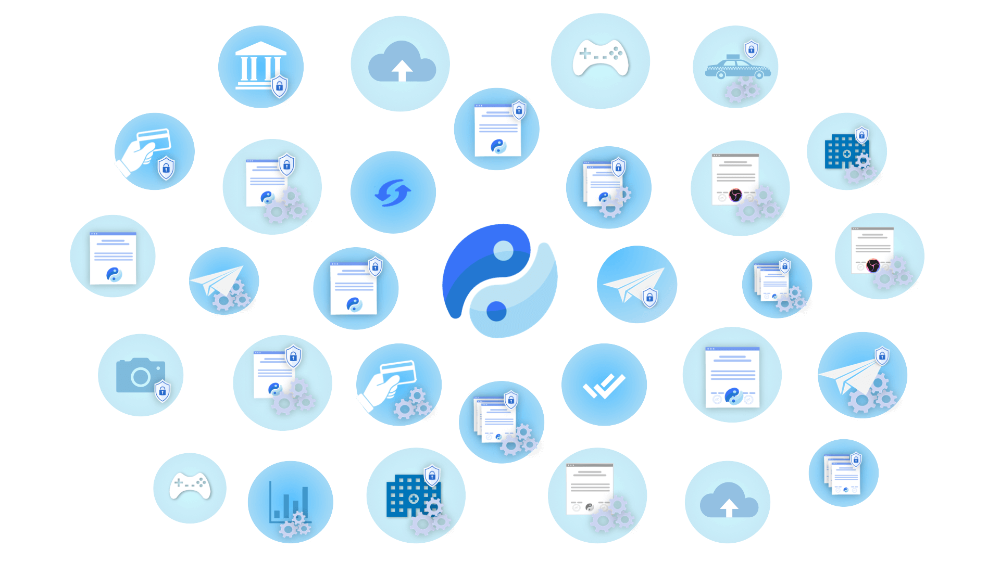

# Trustless Hub

[Trustless Hub](https://github.com/trstlabs/trst) is a smart contract blockchain with built-in automatic execution. You can build and deploy Self-Executing Smart Contracts to a large decentralized worldwide community. Trustless Hub is built on the [Cosmos SDK](https://docs.cosmos.network), and CosmWasm - Wasm-compiled Rust smart contracts, used by most Cosmos SDK Chains. CosmWasm Smart contracts are safer and more effient compared to other smart contracts.

Trustless Hub enables new services using encrypted inputs, time-based execution, 1-click recurring execution and verifiable data.

Use-cases include recurring swaps for DeFi, 1-click recurring transactions for payment and in-game battles with time-based winner appointment for gaming. As Trustless Hub's smart contract open up many new usecases on-chain, why we call these Trustless Contracts.

## 4 pillars of Trustless Contracts

1. Front-running resistance
2. Time-based Execution
3. Recurring transactions with one click
4. Verified Contract Templates

Any CosmWasm code, like smart contracts on Juno, Osmosis, Secret Network and Archway can extend their functionality through Inter-Blockchain Communication (IBC)., or be transformed into a Trustless Contract.

## Use Cases

 1. DeFi
 2. Payments
 3. Gaming

Developers on other Chains and contract platforms will be able to use and integrate Trustless Hub's Rust-based Smart Contracts. DAOs can use payroll services, NFT creators can build in time-based minting and subscriptions. Games can do in-game battles with time-based battles and automatic winner appointment.

In the Use Case section we'll dive more into each of these

## TRST Token

TRST is the native token of Trustless Hub and is used for:

* Automatic execution of smart contract
* Storing, instantiating and executing Contracts
* General transaction fees

You can also stake your TRST by delegating your TRST to validators. On-chain governance through TRST is to keep the chain secure through economic costs. Yoiu vote on important proposals such as chain upgrades, fees, incentives and parameter changes.

## Using BFT consensus and Cosmos SDK

Many projects already showcase the Tendermint BFT consensus engine and the Cosmos SDK. Explore the [Cosmos Network Ecosystem](https://cosmos.network/ecosystem/apps) to discover a wide variety of apps, blockchains, wallets, and explorers that are built in the Cosmos ecosystem.

## Applications built with Trustless Hub

* [Interact - Wallet](https://interact.trustlesshub.com)
* CosmoPortal - DEX Aggregator & Payments (alpha)
