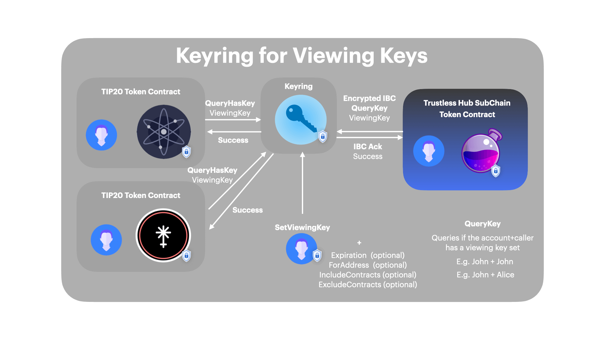

# Keyring

The Keyring contract manages viewing keys for privacy-perserving contracts
Viewing keys allow specified individuals, including the owner of the account to query account-specific information such as transaction histories and balances.
Queries are free and do not require signatures.
As each contract has its own balances, having to create viewing keys for each contract is cumbersome and gas expensive.
Hence, developers can integrate a Keyring contract. Here, keys are managed in one place. 

A query can be called which looks like this on the frontend:

```javascript
 let balanceResponse =
          await this.trustlessjs.query.compute.queryContractPrivateState({
            address: this.tip20_contract_address,
            query: {
              balance: {
                address: this.session.address,
                key: viewingKey,
              },
            },
          })
        
```

On the TIP20 Contract of the requested balance address is query sender + the address of the caller is passed through to the Keyring contract.
The Keyring gives back a success response, which is sufficient for the TIP20 token contract to know that the viewing key is present.
On success, TIP20 contract gives back an encrypted response with the balance.


