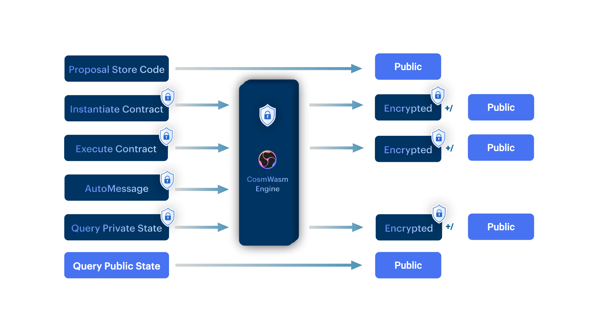

# Encryption

When developing Trustless Contracts it is important to understand what is private and what is public.

*A high-level overview of the transaction process for each message type is as follows:*

1. Inputs are encrypted and then sent to a secure environment
2. There, inputs are decrypted, you can alter the state, which is then stored in an encrypted way
3. The outputs are encrypted and sent back to the message sender. Additionally open and verifiable logs can be made which update the Public Contract State, for anyone to view. 

The AutoMessage does not expose any output as it is an internal transaction but it can update the public state.

- Code template is stored, and Trustless Contract instances can be instantiated by anyone
- When instantiated, the contract will run for a set duration or forever.
- AutoMsg is called at a ceretain time or at predefined intervals
- Anyone can execute and query the contract, so as a developer. Through viewing keys, access can be granted to the account owner. Viewing keys can also be shared.

## Viewing Keys

