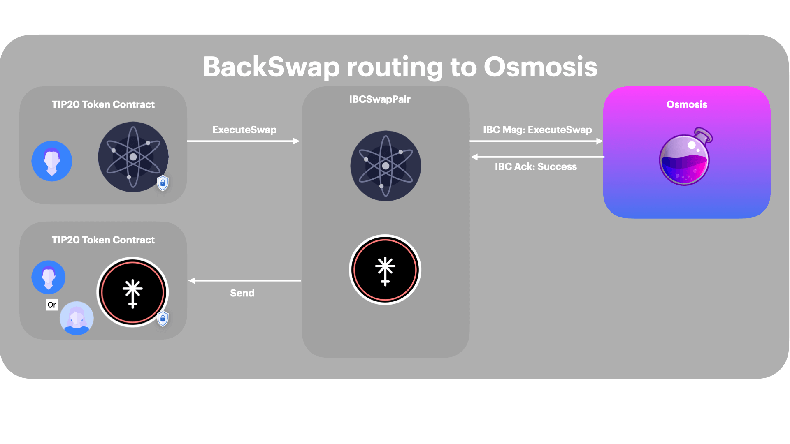
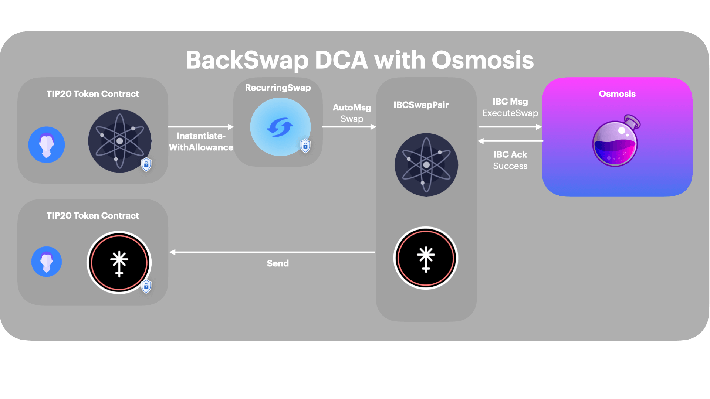

# IBC Contract Calls

Trustless Contracts extend their functionality to other chains. In the near future, DEXes, DAOs and other services can extend their functionallity by integrating with our predefined Trustless Contract templates. Below are examples for a number of use cases for IBC-enabled chains and contracts.

*A high-level overview of the transaction processes for interacting with IBC-enabled chains is as follows:*

## Integration with DEXes

By sending an execute transaction to the TIP20-ics20-osmosis contract (TBD) you can swap to Osmosis. By adding custom time-based logic into your AutoExecution contract you can use this to DCA with price conditions. You can also build custom IBC contracts that connect to DEXes on different chains, or aggregate over multiple DEXes to swap with the best price, recurringly.

Osmosis actions that will be suported by TIP20-ics20-osmosis:
* Swap: Swap assets
* JoinPool: Add liquidity
* ExitPool: Exit liquidity

#### Examples

1. Swapping to Osmosis, then getting back a TIP20-wrapped token. 

2. Dollar-cost averaging, or recurringly swapping, to Osmosis, then getting back a TIP20 token.

#### Transparency and auditability

IBC calls to public chains are public. The ExecuteSwap message type from the TIP20 token contract to the TIP20-ics20-osmosis contract can be guessed based on gas and network usage. As the callback from TIP20-ics20-osmosis to the swapped TIP20 token is on Trustless Hub, the receiver address can remain unknown to the public. The token received, the balance and transaction history is only viewable through a viewing key unless the owner explicitly sets its TIP20 account to public. Also, TIP20 token admins may publicize transactions that exceed a certain amount to be in line with privacy regulations.

### Payroll for DAOs

DAOs Distributing funds over a certain period of time. 

#### JIT, Lean and Six Sigma (Just In Time) principles for payment

In Web3, DAO payroll is done by locking up assets. This reduces the liquidity of the DAO and increases liquidity risks. DAO to DAO recurring payment allows DAOs to be funded time-based. The DAO can then recurringly distribute rewards to community members with just one click.

Just like in the traditional finance world, send recurring payment to multiple addresses with 1 click. You, a payment platform orthe recipient can set up a recurring swap that matches the interval to receive its salery in the desired currency. 

Set it and forget it!

IBC calls to public chains are public. The recurring transactions are auditable and viewable by admins. The balances are private by default and are acessable through viewing keys. TIP20 contract admins should set privacy controls in line with regulation.

### Other IBC related Use-Cases

1. Remove tedious tasks: Auto-claim rewards, resolve prediction markets, liquidate assets
2. NFT buying - buy or mint NFTs recurringly
3. Lottery - Make a fully on-chain lottery with tokens transferred over IBC
4. In-game battling with time-based winner appointment for NFTs on other chains. Give allowance for a game contract on Trustless Hub to use your NFT in an in-game battle