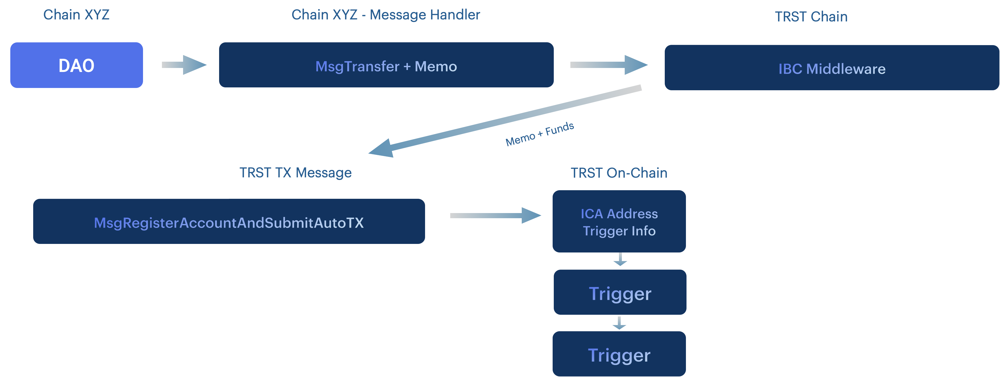
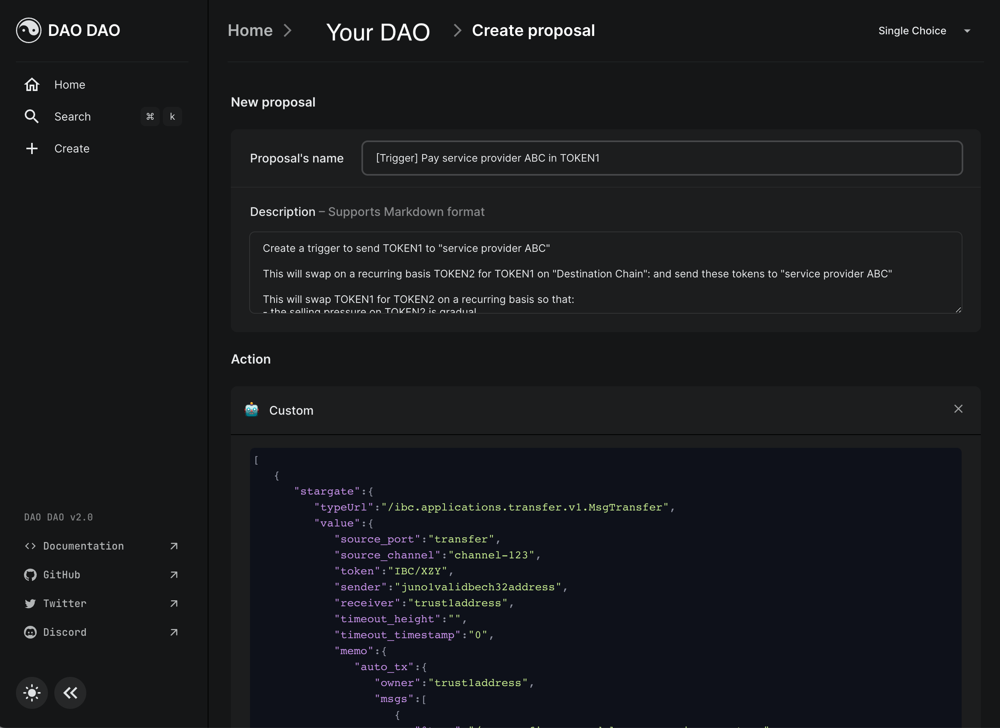
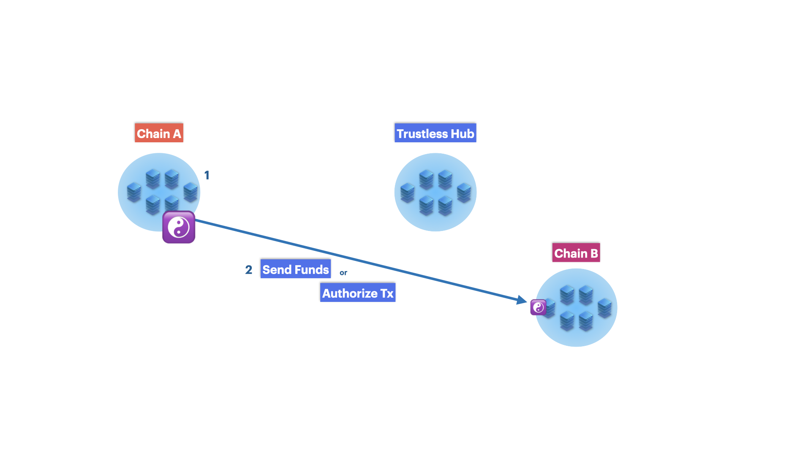
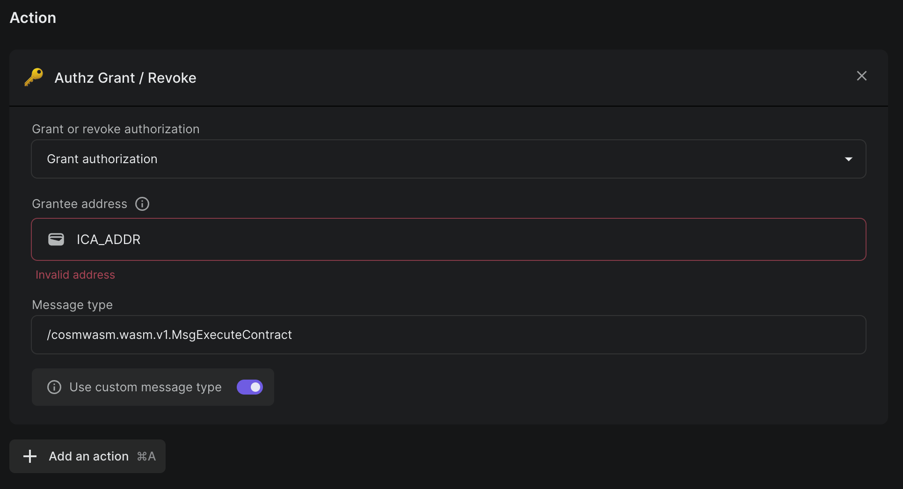
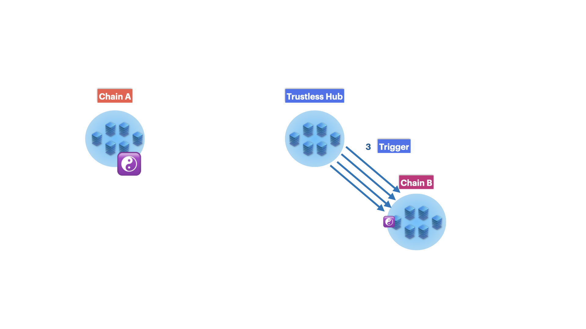

## Setting up Automation

In the previous step we showed how the trigger process looks like by submitting an AutoTX on Intento. You can do this with the [TriggerPørtal](triggerportal.zone) interface, a TrustlessJS front-end integration or locally through the CLI. 

In addition, you can also submit an AutoTX from another chain using the [ICS20 standard](https://github.com/cosmos/ibc-go/blob/main/docs/apps/transfer/messages.md). 


## Automation for DAOs

Setting up a trigger on a different source chain than Intento can be particularly useful for DAOs. Using this middleware, DAOs can now automate tasks not only on the source chain but also on different destination chains. DAOs can automate periodic token swaps, payroll, payment in installments amongst other scheduled actions. These can be performed in one proposal, which normally require periodically voting on individual proposals. This requires manual action from the proposer and DAO participants. 

With automation over Intento, this can be simplified to one proposal. In addition, DAO participants do not need to worry about immediate changes in the liquidity position of the DAO, as the DAO does not need to move funds to a smart contract upon the vote.

## ICS20 Middleware

ICS20 is the interchain standard that enables the transfer of fungible tokens between independent blockchains within the Cosmos ecosystem. It is a protocol that defines a standard interface for token transfers across different blockchains that implement the Inter-Blockchain Communication (IBC) protocol.

With ICS20 transfer middleware, you send a transfer with a memo on a chain, and Intento will convert this ICS20 message to an AutoTx trigger submission. Using an ICS20-standard transaction, accounts on other chains can create triggers. A MsgRegisterAccountAndSubmitAutoTx or a MsgSubmitAutoTx can be derrived from the memo field in the ICS20 transfer message.



Our custom middleware is loosely based on the wasmhooks implementation on [Osmosis](https://github.com/osmosis-labs/osmosis/tree/main/x/ibc-hooks).

The mechanism enabling this is a `memo` field on every ICS20 transfer packet as of [IBC v3.4.0](https://medium.com/the-interchain-foundation/moving-beyond-simple-token-transfers-d42b2b1dc29b).

ics_middleware.go is IBC middleware that parses an ICS20 transfer, and if the `memo` field is of a particular form, it creates a trigger by parsing and handling a SubmitAutoTx message.

These are the fields for `auto_tx` that are derived from the ICS20 message:

* Owner: This field is directly obtained from the ICS20 packet metadata and equals the ICS20 recipient. If unspecified, a placeholder is made from the ICS20 sender and channel.
* Msg: This field should be directly obtained from the ICS20 packet metadata.
* FeeFunds: This field is set to the amount of funds being sent over in the ICS20 packet. One detail here is that the denom in the packet is the source chains representation of the denom, this will be translated into TRST on Intento.

The constructed message for MsgSubmitAutoTx will contain the following:

```go
msg := MsgSubmitAutoTx{
 // If let unspecified, owner is the actor that submitted the ICS20 message and a placeholder only
 Owner: "trust1-hash-of-channel-and-sender" OR packet.data.memo["auto_tx"]["owner"],
 // Array of Msg json encoded, then transformed into a proto.message
 Msgs: packet.data.memo["auto_tx"]["msgs"],
 // Funds coins that are transferred to the owner
 FeeFunds: sdk.NewCoin{Denom: ibc.ConvertSenderDenomToLocalDenom(packet.data.Denom), Amount: packet.data.Amount}

 // other fields
```

### ICS20 packet structure

So given the details above, we propogate the implied ICS20 packet data structure.
ICS20 is JSON native, so we use JSON for the memo format.

```json
{
    //... other ibc fields that we don't care about
    "data":{
       "denom": "TRST denom on counterparty chain (e.g. ibc/abc...)",
        "amount": "1000",//for execution fees
        "sender": "...", 
        "receiver": "A TRST addr prefixed with trust1",
         "memo": {
           "auto_tx": {
            "owner": "trust1address", //owner is optional
              "msgs": [{
                "@type":"/cosmos.somemodule.v1beta1.sometype",
                //message values in JSON format
            }],
            "duration":"111h",
            "start_at":"11h",
            "label":"my_label",
            "interval":"11h",//optional
            "cid":"connection-0", //connection ID is optional, omit or leave blank in case local TRST message.
            "cp_cid":"connection-0", //counterparty connection ID is optional and is only needed to register ICA.
            "register_ica": "false",//optional, set to true to register interchain account
            //////configuration,optional
            "save_responses":"true",//save message responses of Cosmos SDK v0.46+ chain output, defaults to false
            "update_disabled":"true",//optional, disables the owner's ability to update the config, defaults to false
            "stop_on_success":"true",//optional, defaults to false
            "stop_on_fail":"true",//optional, defaults to false
        },
    }
}
}
```

An ICS20 packet is formatted correctly for submitting an auto_tx if the following all hold:

* `memo` is not blank
* `memo` is valid JSON
* `memo` has at least one key, `"auto_tx"`
* `memo["auto_tx"]["msgs"]` is an array with valid JSON SDK message objects with a key "@type" and sdk message values
* `receiver == memo["auto_tx"]["owner"]`. Optional, an owner can be specifed and is the address that receives remaining fee balance after execution ends.
* `memo["auto_tx"]["cid"]`is a valid connection ID on TRST -> Destination chain, omit it for local TRST execution of the message.
* `memo["auto_tx"]["register_ica"]` can be added, and true to register an ICA.

Fees are paid with a newly generated and AutoTX specific fee account.

If an ICS20 packet does not contain a memo containing "auto_tx", a regular MsgTransfer takes place.
If an ICS20 packet is directed towards AutoTX, and is formated incorrectly, then it returns an error.

## Example: DAO Integration


Using ICS20 to set up a `Trustless Trigger` is for advanced users that are familiar with terms such as ICS20 transfers and Authz permissions.

Our ICS20 middleware is developped to allow DAOs to perform time-based actions. These can be executed locally on Intento, a destination chain which can also be the source chain.

There are several caveats to using ICS20 to set up a trigger. When automating on a destination chain for the first time, not one but two transactions is required to activate the trigger. One transaction is to set the trigger and create an Interchain Account at Intento and another is to set permissions/send funds to the Interchain Account on the destination chain. 

To demonstrate how DAOs can integrate with Trustless Triggers we explain the process using an example.

`DAO` wants to pay `Service provider ABC` for their services that they provide on a monthly basis in `TOKEN1` and holds `TOKEN2` and `JUNO`.

*Service provider ABC invoice example*


In this example a `DAO` on DAODAO triggers a swap of TOKEN2 for TOKEN1 on dex "DEX"  on a recurring basis.
Then it can automatically send these tokens to `Service provider ABC`.
This is a neat use case for Trustless Triggers as it requires movement from assets between chains and accounts. The tokens to send can remain in control of the DAO. 
As Trustess Triggers are on-chain, the process can be done completely without trusted third parties.

The DAO can appoint an owner that can manage the trigger or use a placeholder account on Intento to remain in full control.

For this invoice example we have the following proposal name and description:

*Example Proposal name*

```md
[Trigger] Pay service provider ABC in TOKEN1
```

*Example Description*

```md
Submit a trigger to send TOKEN1 to "service provider ABC"

This will swap on a recurring basis TOKEN2 for TOKEN1 on dex "DEX" on Destination Chain and send these tokens to "service provider ABC" 
This will swap TOKEN1 for TOKEN2 on a recurring basis so that:
- the selling pressure on TOKEN2 is gradual
- we maintain a positive cash flow

This Trigger on Intento allows us to automate asset workflows. It allows our DAO to maintain positive cashflow and have better liquidity.
```

Having adequate liquidity is crucial to ensure smooth operations and financial stability. It enables you to fulfill your financial obligations to suppliers, lenders, and other stakeholders, which strengthens your credibility and reputation in the marketplace. With sufficient liquidity, you can easily pay for bills and expenses, invest in growth opportunities, and effectively manage your DAO's resources. Thus, prioritizing and managing liquidity effectively can help you achieve long-term success and sustainable growth.

### 1. Submitting AutoTX


Submit a proposal with a custom message to execute. For a CosmWasm-based DAO like [DAO DAO](https://daodao.zone/) DAOs on Juno, This message contains the ICS20 message`MsgTransfer`. In the `memo` you provide the `AutoTx` details such as the messages to automate, time parameters and set a custom label.

Below is how the proposal action message could look like for a CosmWasm-based DAO:

```json
[
  {
    "stargate": {
      "typeUrl": "/ibc.applications.transfer.v1.MsgTransfer",
      "value": {
        "source_port": "transfer",
        "source_channel": "channel-juno__trustless_hub",
        //token should be IBC-denominated TRST, which is used to pay for fees
        "token": {"denom":"ibc/....", "amount":"10"}, 
        // sender - a bech32 address on source chain
        "sender": "juno1validbech32address",
        // the recipient address on Intento
        // is replaced with a newly generated address when auto_tx["owner"] in memo is blank
        "receiver": "trust1address",
        // Timeout height relative to the current block height.
        // The timeout is disabled when set to 0.
        "timeout_height": "0",
        // Timeout timestamp in absolute nanoseconds since unix epoch.
         // The timeout is disabled when set to 0.
        "timeout_timestamp": "0",
        "memo": {
           "auto_tx": {
            //owner is optional and should equal recipient
            "owner": "trust1address", 
              "msgs": [{
                "@type":"/someprefix.somemodule.someversion.sometype",
                //add message values 
                //in JSON format
            }],
             //duration from now or from start_at. s=seconds, m=minutes, h=hours
            "duration":"111h",
            //interval is optional. s=seconds, m=minutes, h=hours
            "interval":"11h",
            //start_at is optional, in nanoseconds since UNIX epoch
            "start_at":"1677841601",
            //label is optional 
            "label":"my_label",
            //connection_id is optional, omit or leave blank in case local Intento message.
            "cid":"connection-0", 
            //register_ica is optional, set to true to register interchain account
            "register_ica": "true"
          },
        }
      }
    }
  }
]
```

Here it is important that the `timeout_timestamp` or `timeout_height` takes into account the proposal's end time. Alternatively both of the timeout values can be set to `0`.

Further it is important that the field `register_ica` is set to `"true"` the first time you create an AutoTX. This will register an Interchain Account from Intento on the destination chain.

A message in the `auto_tx["msgs"]` array can be like the following MsgSend:

```json
{
  "@type":"/cosmos.bank.v1beta1.MsgSend",
  "amount": [{
    "amount": "70",
    "denom": "stake"
  }],
  "from_address": "ICA_ADDR",
  "to_address": "some_destination_chain_address"
}
```

For the DAO service provider example, we can have a [SwapAndSendTo](https://github.com/Wasmswap/wasmswap-contracts/blob/main/src/msg.rs#:~:text=%7D%2C-,SwapAndSendTo,-%7B) in a [MsgExecuteContract](https://github.com/CosmWasm/wasmd/blob/main/proto/cosmwasm/wasm/v1/tx.proto) message to swap TOKEN2 for TOKEN1 locally on `Juno`. We can specify the out recipient the recipient's address.

```json
{
    "@type":"/cosmos.authz.v1beta1.MsgExec",
    "msgs": [{
      "@type": "/cosmwasm.wasm.v1.MsgExecuteContract",
      "msg": {
        "swap_and_send_to": {
        "input_token": "TOKEN2",
        "min_token": "500",
        "recipient":"juno1_SERVICEPROVIDER_ABC_ADDR",
        }
       },
      "sender": "juno1_DAO_ADDR", 
      "contract": "juno1_SWAPPAIR_ADDR",
      "funds": []
    }],
    "grantee": "ICA_ADDR", //TIP: leave "ICA_ADDR" as is
}
```

:::tip write `ICA_ADDR` as a `grantee` or any other field in the message and Intento will parse the to-be defined Interchain Account address. This is transformed when the first execution happens.
:::

Alternatively, we can perform [MsgSwapExactAmountOut](https://github.com/osmosis-labs/osmosis/blob/main/proto/osmosis/gamm/v1beta1/tx.proto#:~:text=message-,MsgSwapExactAmountOut,-%7B) to `Osmosis`  given that there are funds on the DAO's TrustlessHub-Osmosis Interchain Account on Osmosis. To send funds for execution, the DAO can make a proposal for `MsgTransfer` that funds the Intento Interchain Account. The DAO then controls a trigger on Intento that controls the swap.  

### 2. Setting Up Permissions and Funds




*Proposal 2 can be the following and should contain the ICA_ADDR, which can found by querying the interchain account address.* 

The ICA_ADDR should also have some [funds to execute](#paying-for-fees) and have the proper [permissions](#setting-permissions) set up

:::tip write ICA_ADDR as a `sender` or any other field in an AutoTX and Intento will parse the to-be defined Interchain Account address.
:::

#### Sending funds

Trigger fees, or 'AutoTx fees on Intento are paid from the funds sent in the ICS20 message.

**Execution on Intento**

If you want to execute messages locally on Intento, set `auto_tx["connection_id"]` to `""`. The funds sent with the ICS20 transfer will be used to pay for AutoTx fees. For local transactions there is no additional fee charged.

**With execution over IBC**

To execute triggers succesfully on `destination chain`, the `ICA` on the destination chain should be funded with `destination chain`'s fee token.
Fees can be funded by directly sending tokens to the ICA on `destination chain` by a DAO member before the first execution starts. <!-- Fees can  granting the ICA to use fees from another account using a Feegrant. -->

A trustless approach is available too. You can submit an additional proposal to send `MsgTransfer` to `destination_chain` with the `destination_chain_ica_address` as the receiver.

For the DAO example, a similar proposal to the above can be sent. This does not take a `memo`. Here's an example:

```json
[
  {
    "stargate": {
      "typeUrl": "/ibc.applications.transfer.v1.MsgTransfer",
      "value": {
        "source_port": "transfer",
        "source_channel": "channel_source_chain__destination_chain",
        "token": {"denom":"ibc/....", "amount":"10"}, 
        "sender": "dao_address",
        "receiver": "destination_chain_ica_address",
        "timeout_height": "0",
        "timeout_timestamp": "0",
        "cid":"connection-0123", 
      }
    }
  }
]

```

:::tip Alternatively, if the destination chain is the same as the source chain, the DAO can create a FeeGrant for the `destination_chain_ica_address`.
:::

#### Setting permissions

Alternatively, you can create a FeeGrant for the `destination_chain_ica_address` when the DAO is present on destination chain. You can also allow the ICA address to execute transactions for the DAO using `AuthZ`. [Here](https://blog.cosmos.network/secret-powers-what-are-the-authz-and-fee-grant-modules-c57d0e808794) is an article explaining the power of both `FeeGrant` and `AuthZ`.

Initiating a trigger for the first time locally on Juno can be done as follows:

 1. Proposal 1 Message 1: IC20 token tranfser: Submit AutoTX on Intento.  In the `auto_tx` memo, `msgs` should contain AuthZ's MsgExec with `MsgExecuteContract`.
 2. Proposal 2 Message 1: Allow the DAO's JUNO tokens to be used for fees by `destination_chain_ica_address` with a FeeGrant.  
  Proposal 2 Message 2: AuthZ grant to ICA to execute `MsgExecuteContract`.

 For a DAO swapping tokens on a recurring basis on Osmosis for the first time, 2 proposals should be made.

 1. Proposal 1 Message 1: IC20 token tranfser: Submit AutoTX on Intento. In the `auto_tx` memo, `msgs` should contain AuthZ's MsgExec with `MsgSwapExactAmountOut`
 2. Proposal 2 Message 1: Send OSMO tokens to using `MsgTransfer` to `destination_chain_ica_address`.  
  Proposal 2 Message 2: AuthZ grant to ICA to execute `MsgSwapExactAmountOut`.

<!-- FeeGrant typeURL:  `/cosmos.feegrant.v1beta1.Grant`
AuthZ typeURL: `/cosmos.authz.v1beta1.MsgGrant` -->

Only one proposal action containing the `auto_tx` memo has to be specified, when the funds and grants are in place from a previous action on that particular Interchain Account.

Setting up a trigger from one chain to another is a lengthy process which may be difficult to understand for end-users. The process can be simplified in the future, by creating abstractions of the actions in DAO tooling such as DAODAO.

### 3. Managing Triggers

On [TriggerPørtal](https://triggerportal.zone/), you can view, manage and create triggers.


